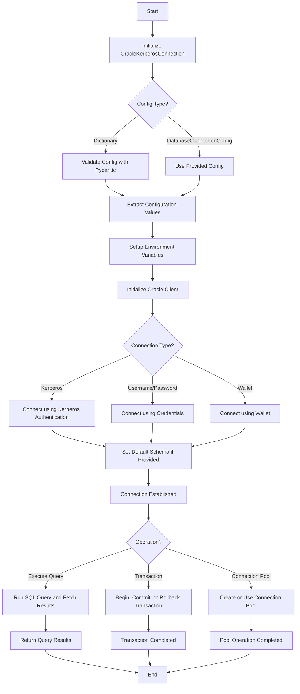

# EZ Connect Oracle Flow

This diagram represents the high-level flow of the connection process in the OracleKerberosConnection class. Let me know if you'd like to customize it further or focus on a different part of the workflow.

