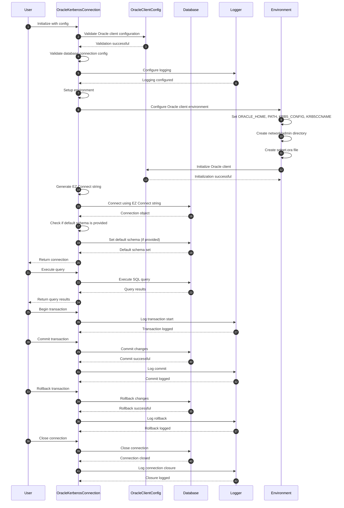

# EZ Connect Oracle Sequence

- Validation Steps:
Validation of OracleClientConfig and DatabaseConnectionConfig.
- Environment Configuration:
Setting environment variables like ORACLE_HOME, PATH, KRB5_CONFIG, and KRB5CCNAME.
Creating necessary directories and configuration files (sqlnet.ora).
- Connection Establishment:
Generating the EZ Connect string.
Connecting to the database and optionally setting the default schema.
- Query Execution:
Interaction with the database to execute queries and return results.
- Transaction Management:
Explicit steps for beginning, committing, and rolling back transactions.
- Connection Closure:
Closing the connection and logging the closure.

